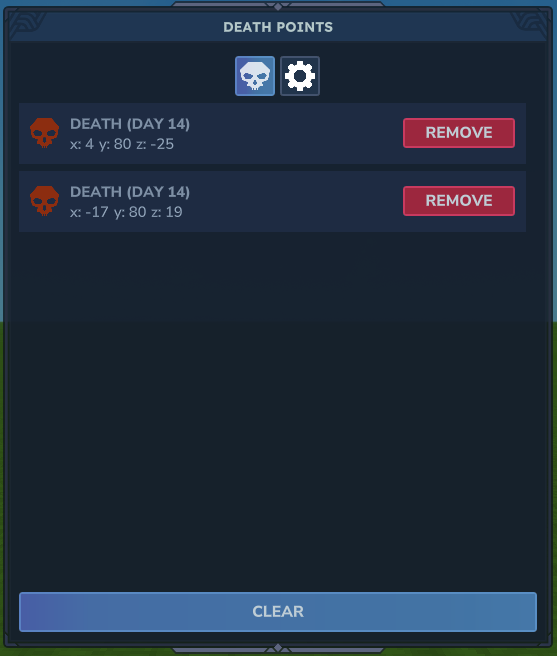
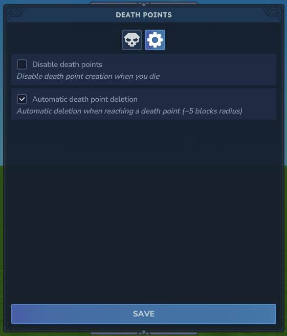

DeathPoints is a Hytale mod that simplifies death points management.

## Features

The mod enables you to manage your death points through a menu. You can easily remove one death point or clear them all. 
Management is done for the world you’re currently in. The mod also enables to be teleported to a death point (requires a
specific permission).

The mod also comes with personalization options which are managed through the death points menu too. The following options are following:

- Disable death points meaning no death point will be created when you die.
- Automatic death points deletion meaning a death point will be automatically deleted when you reach its position in a 5 blocks radius.

## Commands

- `/deathpoints (aliases: deathpoint, dp)` → Open the death points management menu for the current world.

## Permissions

- `com.github.syr0ws.deathpoints.command.deathpoints` → Access the /deathpoints command.
- `com.github.syr0ws.deathpoints.teleport` → Allow to be teleported to a death point.

## Languages

The following languages are supported: en-US (default), fr-FR.

_If you want your language to be supported, feel free to ask or to submit a pull request._

